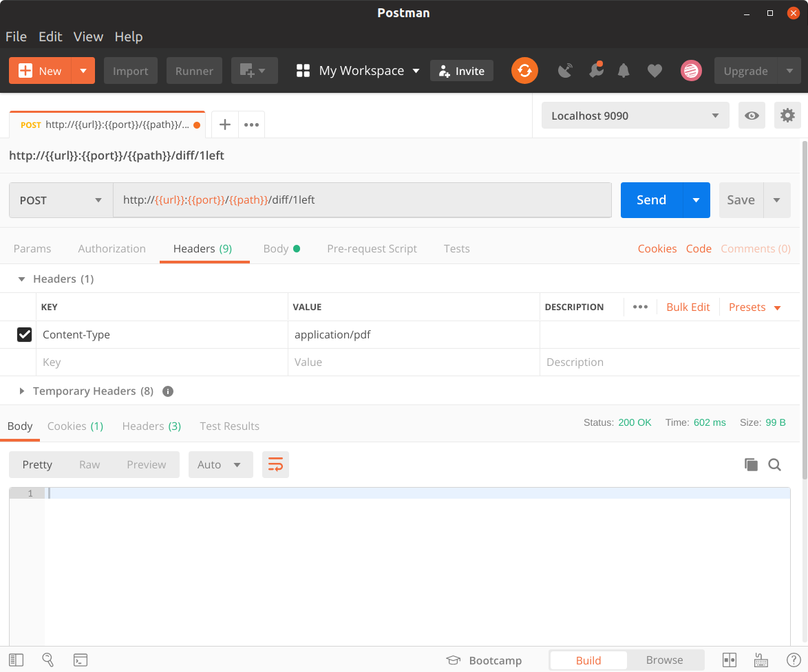
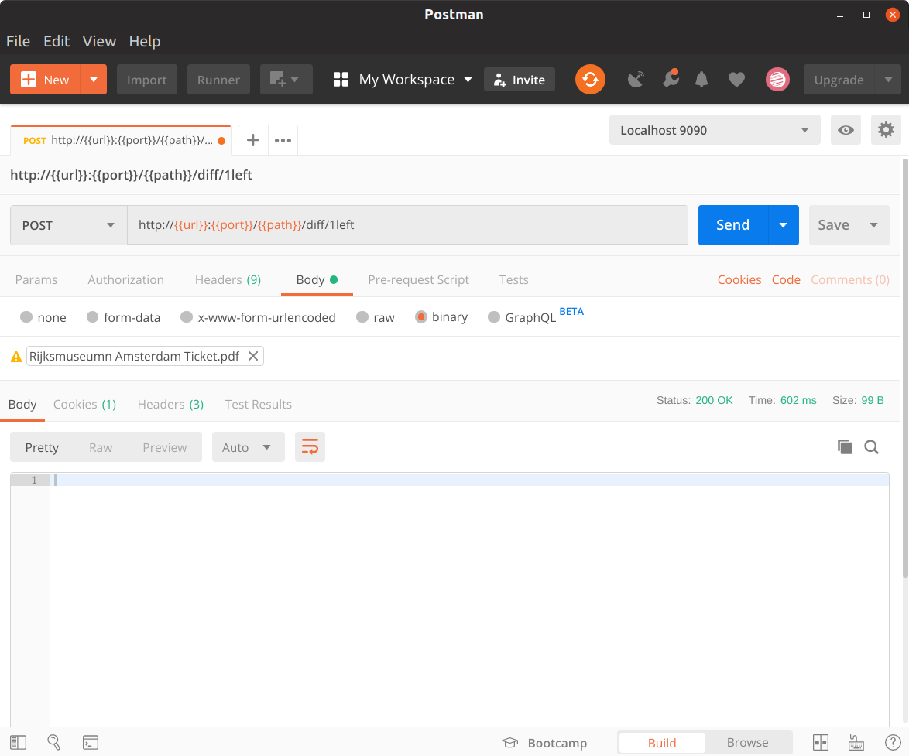

# sample-storage

Please, this is not a scalable solution, since it handles files directly. If I wanted a scalable application, 
probably I would used Firebase. It is just a sample application that I've created to see how to handle file 
upload within Spring Boot.

## Prerequisites

* JDK 11
* Apache Maven 3.6.0

## Dependencies 

Before everything, you must install the Commons Project in your local environment:
```
$ git clone https://github.com/desiderati/commons.git

$ cd commons

$ mvn clean install
```

## A) Running the project from the scratch
```
$ git clone https://github.com/desiderati/samples.git

$ cd samples/sample-storage

$ mvn clean install

$ java -Xms256m -Xmx512m -jar target/sample-storage-1.0.0-SNAPSHOT-exec.war
```

## B) Running the project using Docker Image
```
$ id -u ${USER}

$ docker run -it -p 9090:9090 --rm -e LOCAL_USER_ID={id} desiderati/sample-storage:latest 
```

### Example
```
$ id -u ${USER}
1000
$ docker run -it -p 9090:9090 --rm -e LOCAL_USER_ID=1000 desiderati/sample-storage:latest 
```

## C) Building the project 
```
$ docker build -t desiderati/sample-storage:latest .

$ docker push desiderati/sample-storage:latest
```

## D) Using the application
```
http://localhost:9090/sample-storage/swagger-ui.html
```

* Both http://localhost:9090/api/v1/diff/1/left and http://localhost:9090/api/v1/diff/1/right must define 
the right _Content-Type Header_ according to file type and the _Body_ must be _Binary_.



